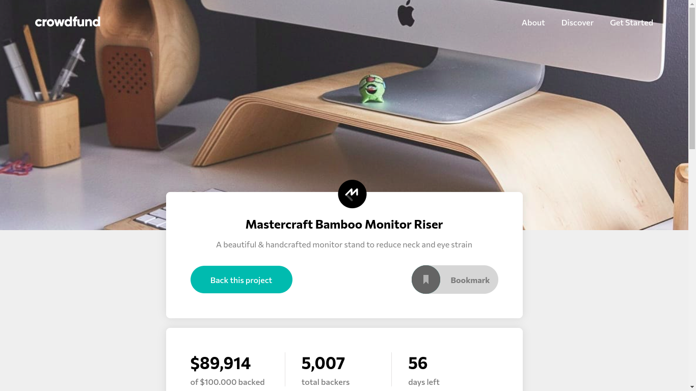
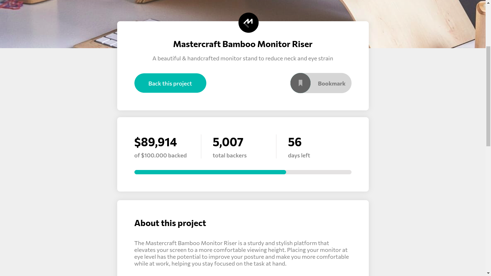

<div align="center">
  
  <h1>Crowd Funding Product Page</h1>
  <p>Challenge from <a href="https://www.frontendmentor.io/challenges/crowdfunding-product-page-7uvcZe7ZR">Frontend Mentor</a>
  </p>
  <p>
    <a href="https://crowdfunding-product-page-react.vercel.app/">Preview</a> ·
    <a href="https://github.com/DanteBenicio/crowdfunding-product-page-react/issues">Report Bug</a> ·
    <a href="https://github.com/DanteBenicio/crowdfunding-product-page-react/pulls">Request Feature</a>
  </p>

  [](https://crowdfunding-product-page-react.vercel.app/)

  
  
</div>

## ❔ About this Project

Project created from [Frontend&nbsp;Mentor](https://www.frontendmentor.io/home)

Project developed by me [DanteBenicio](https://github.com/DanteBenicio)

Crowd Funding Product Page, is a website created to sell handcrafted monitor stand

## 🚀 Run the project

```bash
# Clone the project from Github
git clone https://github.com/DanteBenicio/crowdfunding-product-page-react

# Access the project folder
cd crowdfunding-product-page-react

# Install the project dependencies
yarn
or
npm install

# Run the project (port 3000 - http://localhost:3000)
yarn dev
or
npm run dev
```